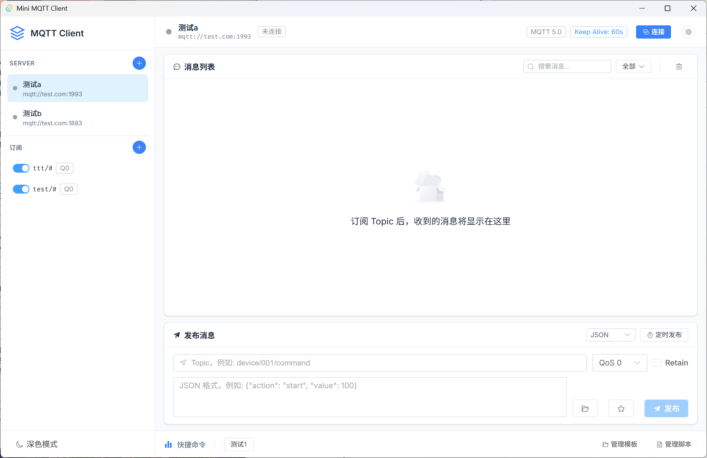
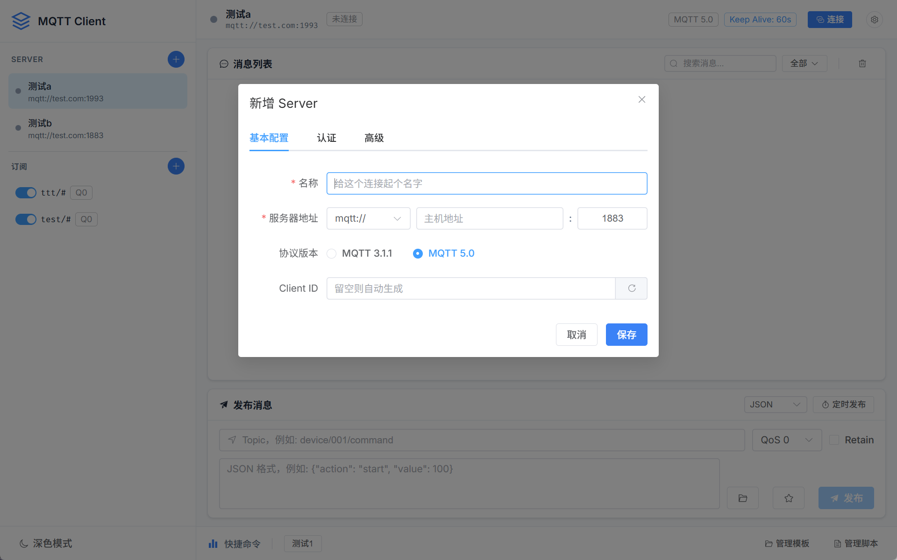
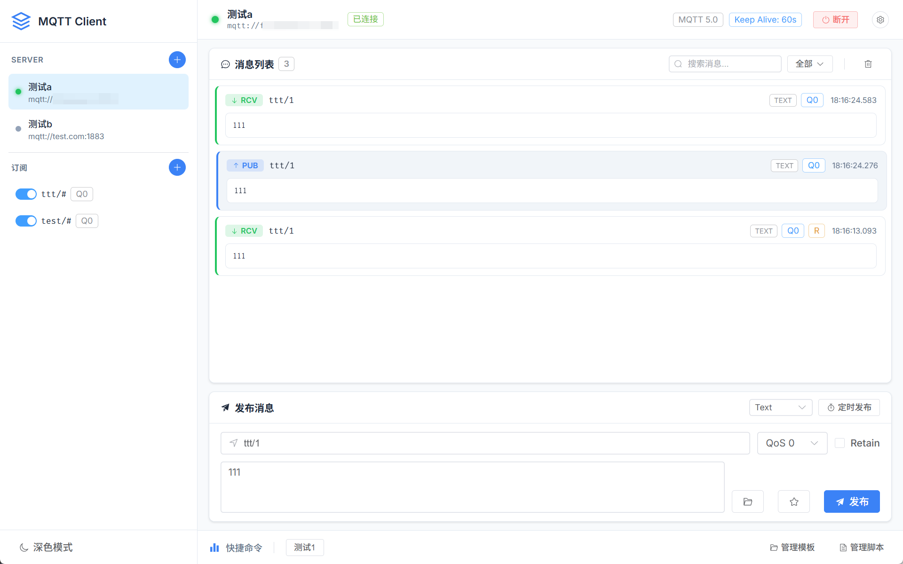
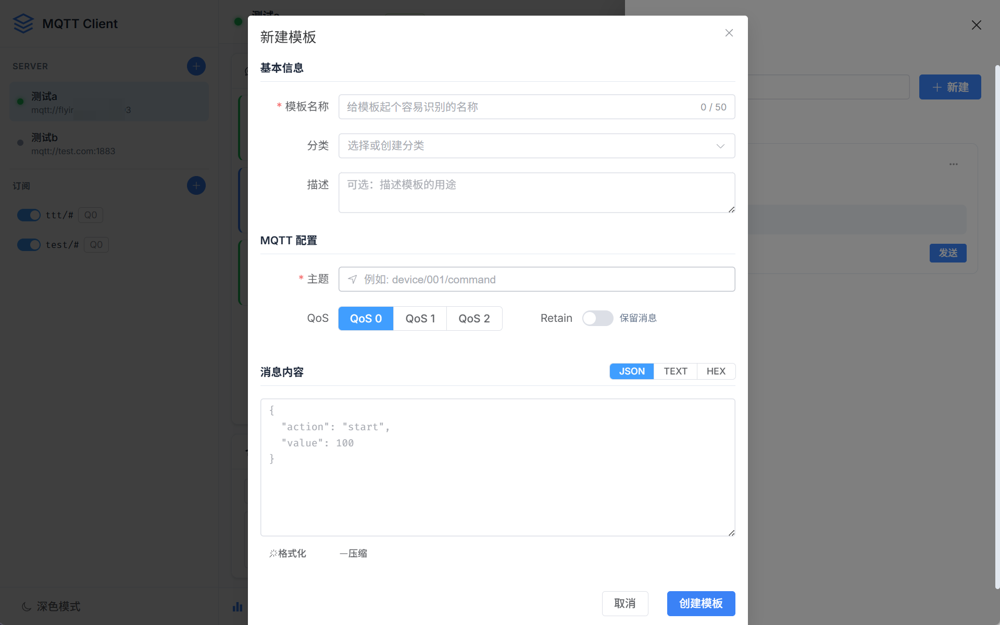
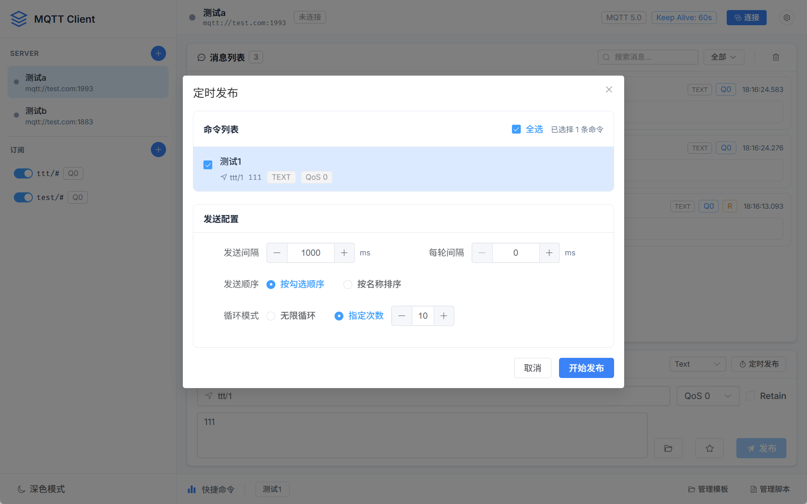
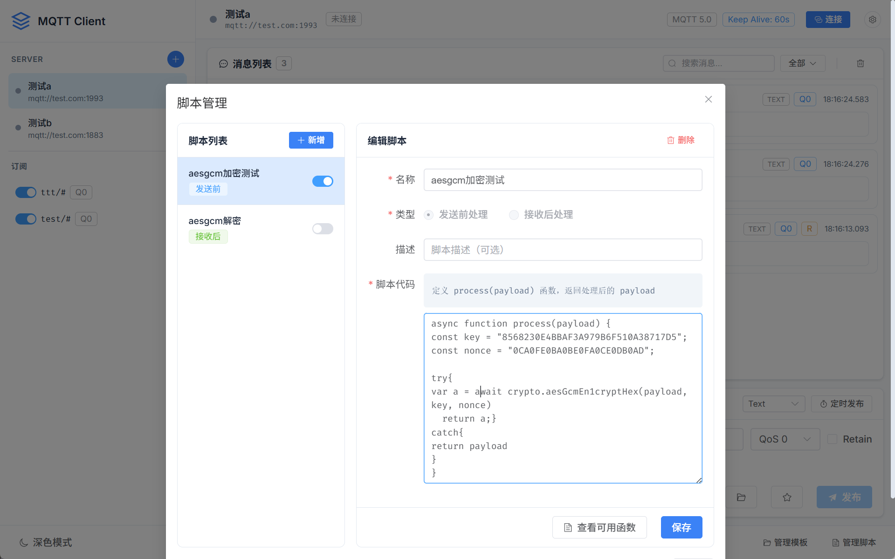

# Mini MQTT Client

[简体中文](README.md) | English

A lightweight, good-looking MQTT debugging client built with Tauri 2 + Vue 3, available for Windows, macOS and Linux.

The interface follows your system language (English or Simplified Chinese) and can be switched at any time in Settings.

<!-- Main window screenshot -->


## Features

### MQTT Connection Management
- Manage multiple server configurations
- MQTT 3.1.1 and 5.0 protocols
- TLS/SSL connections (self-signed CA + client certificate + client private key)

<!-- Server configuration screenshot -->


### Publish & Subscribe
- Subscribe to multiple topics at once
- Wildcard subscriptions (`+` / `#`)
- QoS 0/1/2
- Retained messages
- Switch message format: JSON / HEX / Text

<!-- Message list screenshot -->


### Command Templates
- Save frequently used commands as templates
- Organize templates into categories
- Send with one click

<!-- Command templates screenshot -->


### Scheduled Publishing
- One-off scheduled sending
- Periodic, looped sending
- Flexible interval settings

<!-- Scheduled publishing screenshot -->


### Preprocessing Scripts
- JavaScript script engine
- Before sending: encrypt messages, convert formats
- After receiving: decrypt messages, parse data
- Built-in crypto utilities (AES, SHA, MD5, HMAC and more)

<!-- Script management screenshot -->


### More
- Dark / light theme
- Custom data storage path (pair it with OneDrive to sync across devices)
- Error logging

## Installation

### Download

Download the package for your platform from the [Releases](../../releases) page:

| Platform | Format |
|----------|--------|
| Windows | `.msi` / `.exe` |
| macOS | `.dmg` |
| Linux | `.deb` / `.AppImage` |

### Build from Source

```bash
# Clone the repository
git clone https://github.com/dreamlonglll/mini-mqtt-client
cd mini-mqtt-client

# Install dependencies
npm install

# Development mode
npm run tauri dev

# Release build
npm run tauri build
```

## Tech Stack

| Layer | Technology |
|-------|------------|
| Frontend framework | Vue 3 + TypeScript |
| UI components | Element Plus |
| State management | Pinia |
| Desktop framework | Tauri 2 |
| Backend language | Rust |
| MQTT library | rumqttc |

## Development Environment

- Node.js 18+
- Rust 1.70+
- Recommended IDE: VS Code
  - Extensions: Vue - Official, Tauri, rust-analyzer

## Project Structure

```
mini-mqtt-client/
├── src/                    # Vue frontend source
│   ├── components/         # Vue components
│   ├── stores/            # Pinia stores
│   ├── utils/             # Utilities
│   └── types/             # TypeScript types
├── src-tauri/             # Tauri Rust backend
│   └── src/
│       ├── commands/      # Tauri commands
│       ├── db/           # Data storage
│       ├── mqtt/         # MQTT client
│       └── log/          # Log management
├── docs/                  # Documentation
└── .github/workflows/     # CI/CD configuration
```

## License

[MIT License](LICENSE)
