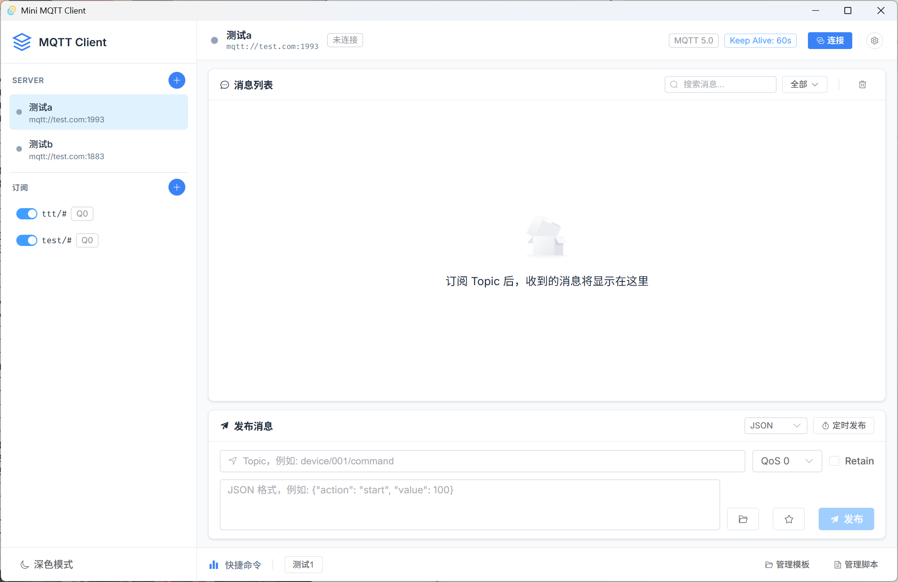
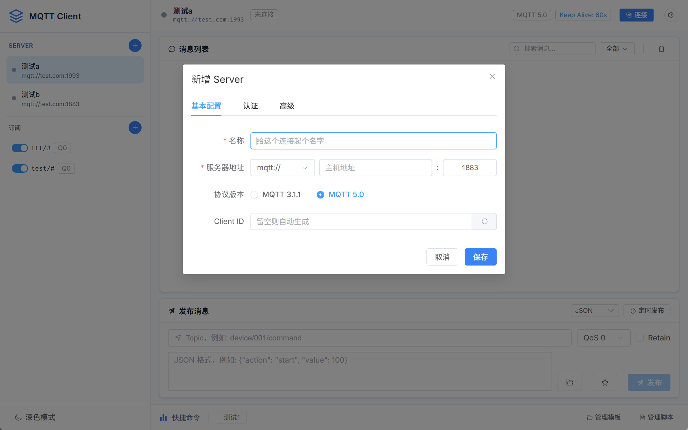
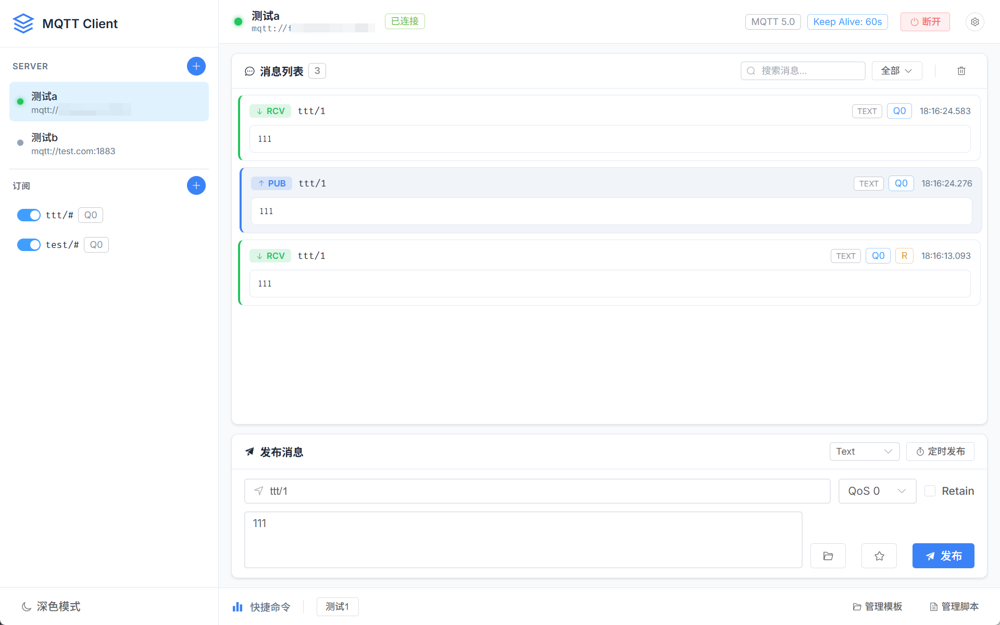
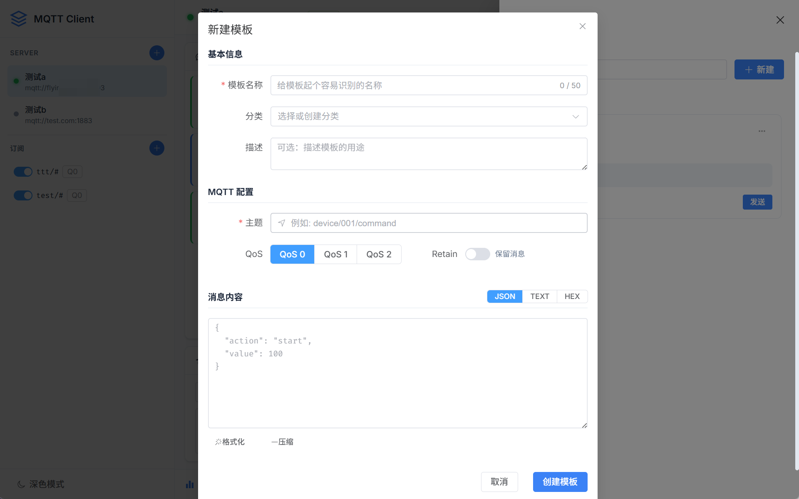
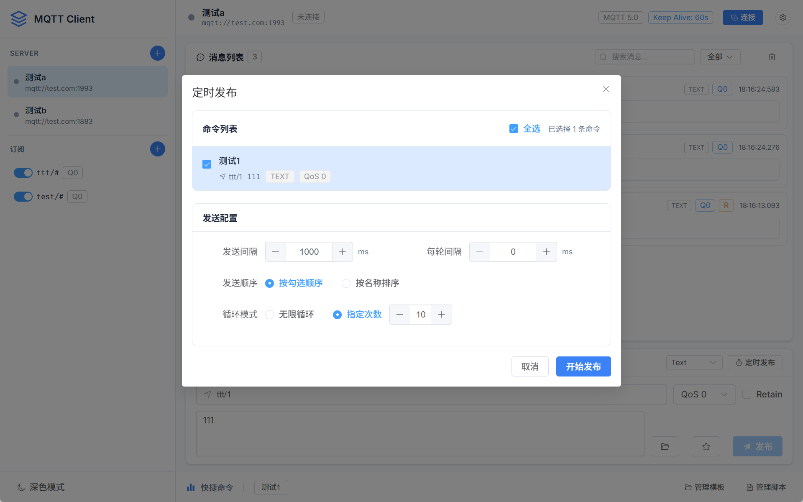
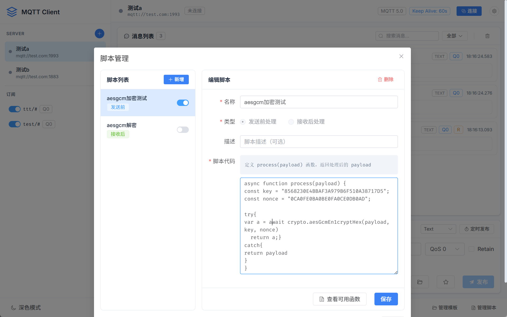

# Mini MQTT Client

一款轻量级、美观的 MQTT 调试客户端，基于 Tauri 2 + Vue 3 构建，支持 Windows、macOS 和 Linux。

<!-- 主界面截图 -->


## 功能特性

### MQTT 连接管理
- 支持多服务器配置管理
- 支持 MQTT 3.1.1 和 5.0 协议
- 支持 TLS/SSL 安全连接 （自签CA + 客户端证书 + 客户端私钥）

<!-- 服务器配置截图 -->


### 消息发布与订阅
- 支持多 Topic 同时订阅
- 支持通配符订阅 (`+` / `#`)
- 支持 QoS 0/1/2 级别
- 支持 Retain 消息
- 消息格式切换：JSON / HEX / Text

<!-- 消息列表截图 -->


### 命令模板
- 保存常用命令为模板
- 支持模板分类管理
- 一键快速发送
- 支持模板导入/导出

<!-- 命令模板截图 -->


### 定时发布
- 支持一次性定时发送
- 支持周期性循环发送
- 灵活的时间间隔设置

<!-- 定时发布截图 -->


### 预处理脚本
- JavaScript 脚本引擎
- 发送前预处理：消息加密、格式转换
- 接收后处理：消息解密、数据解析
- 内置加密工具库（AES、SHA、MD5、HMAC 等）

<!-- 脚本管理截图 -->


### 其他特性
- 深色/浅色主题切换
- 自定义数据存储路径（搭配OneDrive可实现跨端同步）
- 错误日志记录

## 安装

### 下载安装包

前往 [Releases](../../releases) 页面下载对应平台的安装包：

| 平台 | 格式 |
|------|------|
| Windows | `.msi` / `.exe` |
| macOS | `.dmg` |
| Linux | `.deb` / `.AppImage` |

### 从源码构建

```bash
# 克隆仓库
git clone https://github.com/dreamlonglll/mini-mqtt-client
cd mini-mqtt-client

# 安装依赖
npm install

# 开发模式
npm run tauri dev

# 构建发布版本
npm run tauri build
```

## 技术栈

| 层级 | 技术 |
|------|------|
| 前端框架 | Vue 3 + TypeScript |
| UI 组件库 | Element Plus |
| 状态管理 | Pinia |
| 桌面框架 | Tauri 2 |
| 后端语言 | Rust |
| MQTT 库 | rumqttc |

## 开发环境

- Node.js 18+
- Rust 1.70+
- 推荐 IDE: VS Code
  - 插件: Vue - Official, Tauri, rust-analyzer

## 目录结构

```
mini-mqtt-client/
├── src/                    # Vue 前端源码
│   ├── components/         # Vue 组件
│   ├── stores/            # Pinia 状态管理
│   ├── utils/             # 工具函数
│   └── types/             # TypeScript 类型
├── src-tauri/             # Tauri Rust 后端
│   └── src/
│       ├── commands/      # Tauri 命令
│       ├── db/           # 数据存储
│       ├── mqtt/         # MQTT 客户端
│       └── log/          # 日志管理
├── docs/                  # 文档
└── .github/workflows/     # CI/CD 配置
```

## 许可证

MIT License
